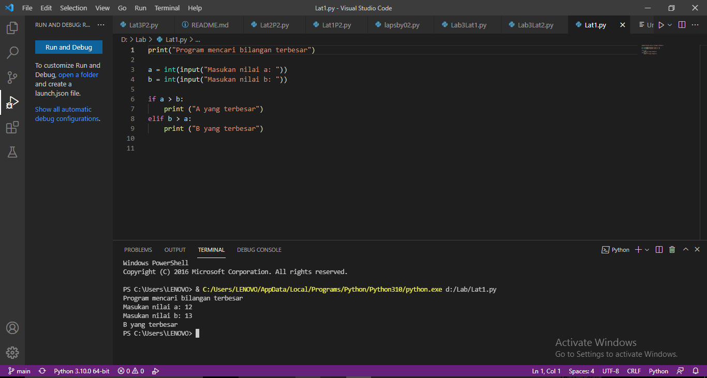
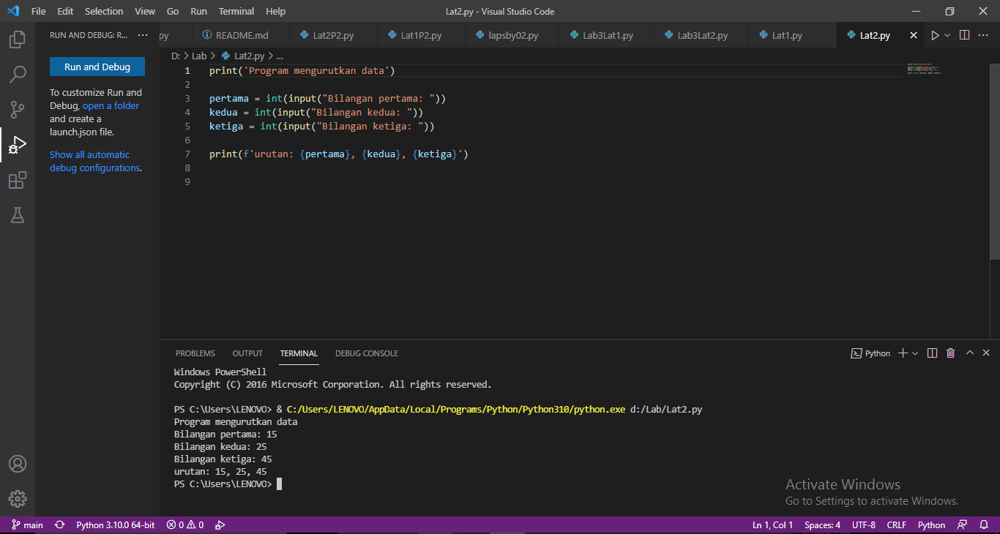
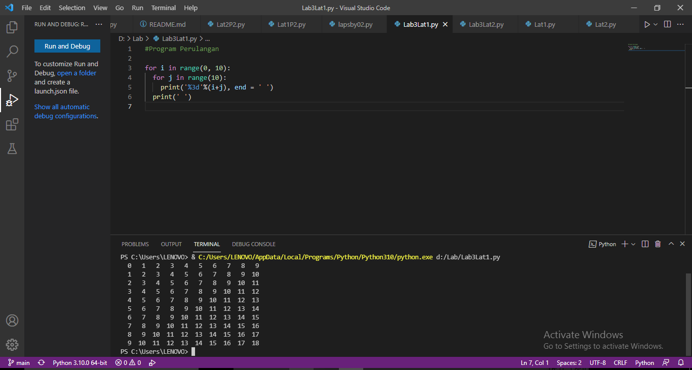
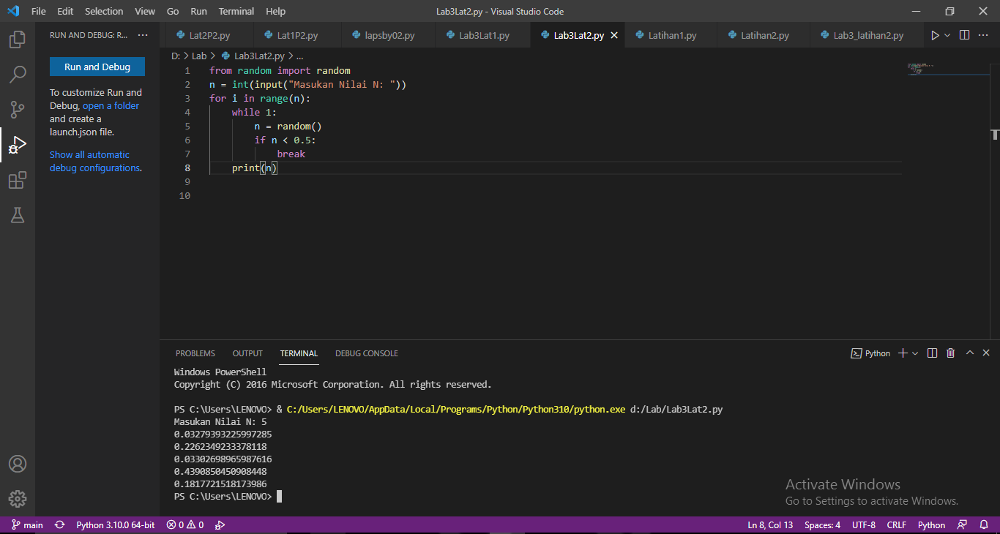

# Labspy1

## Lab 2
### Latihan1
#### Program dan Output
- Program sederhana dengan input 2 buah bilangan serta menentukan bilangan terbesar dari kedua bilangan

```bash
print("Program mencari bilangan terbesar") 

a = int(input("Masukan nilai a: "))
b = int(input("Masukan nilai b: "))

if a > b:
    print ("A yang terbesar")
elif b > a:
    print ("B yang terbesar")
```

### Latihan2
#### Program dan Output
- Program mengurutkan data berdasarkan input jumlah data serta menentukan urutan dari data terkecil

```bash
print('Program mengurutkan data')

pertama = int(input("Bilangan pertama: "))
kedua = int(input("Bilangan kedua: "))
ketiga = int(input("Bilangan ketiga: "))

print(f'urutan: {pertama}, {kedua}, {ketiga}')
```

## Lab 3
### Latihan1
#### Program dan Output
- Program perulangan bertingkat

```bash
#Program Perulangan

for i in range(0, 10):
  for j in range(10):
    print('%3d'%(i+j), end = ' ')
  print(' ')
```

### Latihan2
#### Program dan Output
- Tampilkan n bilangan acak yang lebih kecil dari 0.5
- Nilai n diisi pada saat runtime
- Anda bisa menggunakan kombinasi while dan for untuk menyelesaikannya

```bash
from random import random
n = int(input("Masukan Nilai N: "))
for i in range(n):
    while 1:
        n = random()
        if n < 0.5:
            break
    print(n)
```

## Terima kasih